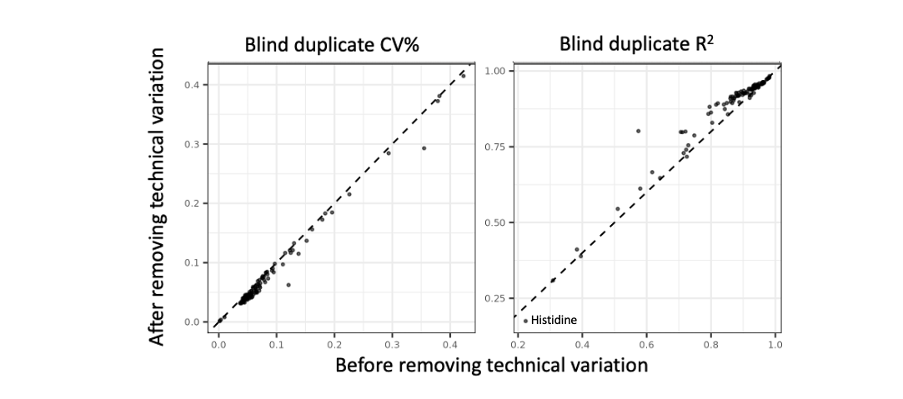

```{r, include = FALSE}
knitr::opts_chunk$set(
  collapse = TRUE,
  comment = "#>"
)
```

This package provides utilities for working with the [UK Biobank NMR metabolomics data](https://biobank.ndph.ox.ac.uk/showcase/label.cgi?id=220).

There are three groups of functions in this package: 

1. [Data extraction](#data-extraction-functions)
2. [Removal of technical variation](#removal-of-technical-variation), 
3. [Recomputing derived biomarkers and computing additional biomarker ratios after adjustment for biological covariates](#methods-for-computing-derived-biomarkers-and-ratios-after-adjusting-for-biological-variation).

All functions are designed to be applied directly to the UK Biobank phenotype data on the [UK Biobank Research Analysis Platform](https://ukbiobank.dnanexus.com/landing) after the NMR metabolomics fields have been extracted using the [Table Exporter](https://dnanexus.gitbook.io/uk-biobank-rap/working-on-the-research-analysis-platform/accessing-data/accessing-phenotypic-data#create-a-tsv-or-csv-file-using-table-exporter) tool. 

This package also works with datasets predating the Research Analysis Platform, which have been extractedusing the [ukbconv](https://biobank.ctsu.ox.ac.uk/crystal/exinfo.cgi?src=accessing_data_guide) tool or processed with the [ukbtools](https://cran.r-project.org/package=ukbtools) R package.

This package also provides a `data.frame` of biomarker information, loaded as `nmr_info`, and a `data.frame` of sample processing information, loaded as `sample_qc_info`. See `help("nmr_info")` and `help("sample_qc_info")` for details on column contents. 

## Citation

If using this package to remove additional technical variation or compute additional biomarker ratios, please cite:

Ritchie S. C. *et al.*, Quality control and removal of technical variation of NMR metabolic biomarker data in ~120,000 UK Biobank participants, <ins>Sci Data</ins> *10* 64 (2023). doi: [10.1038/s41597-023-01949-y](https://www.nature.com/articles/s41597-023-01949-y).

Note that several updates have been made to the package and algorithm based on subsequent releases of NMR metabolomic biomarker data that have expanded to cover all ~500,000 UK Biobank participants with blood samples. These updates are described in more detail in the [Algorithms for removing technical varation](#algorithms-for-removing-technical-variation) section below. The impact of technical variation and its removal in the full UK Biobank data are also shown in the [Technical variation in the full UK Biobank NMR data](#technical-variation-in-the-full-uk-biobank-nmr-data) section below.

Citation is appreciated, but not expected, if simply using the data extraction functions for convenience to extract the NMR biomarker data and associated information as-is into analysis-ready data.frames. 

## Data Extraction Functions

Three data extraction functions are supplied by this package for extracting the UK Biobank NMR data and associated processing information and quality control tags into an analysis-ready format from the CSV or TSV files of field data saved by the [Table Exporter](https://dnanexus.gitbook.io/uk-biobank-rap/working-on-the-research-analysis-platform/accessing-data/accessing-phenotypic-data#create-a-tsv-or-csv-file-using-table-exporter) tool on the [UK Biobank Research Analysis Platform](https://ukbiobank.dnanexus.com/landing).

Exported field data saved by the [Table Exporter](https://dnanexus.gitbook.io/uk-biobank-rap/working-on-the-research-analysis-platform/accessing-data/accessing-phenotypic-data#create-a-tsv-or-csv-file-using-table-exporter) has column names following a [naming scheme](https://dnanexus.gitbook.io/uk-biobank-rap/working-on-the-research-analysis-platform/accessing-data/accessing-phenotypic-data#database-columns) with the format "p<field_id>_i<visit_index>_a<repeat_index>".   

The `extract_biomarkers()` function extracts from this raw field data a `data.frame` that contains one column per [NMR biomarker](https://biobank.ndph.ox.ac.uk/showcase/label.cgi?id=220) which are labelled with short descriptive ( and analysis-friendly) column names for each biomarker. Each row of the extracted `data.frame` corresponds to a single observation for a UK Biobank participant at either baseline assessment (2006-2010) or the first repeat assessment (2012-2013): rows are uniquely identifiable by their combination of `"eid"` and `"visit_index"` columns. The `"eid"` column contains the project-specific identifier for each participant and the `"visit_index"` column contains either a 0 or 1 depending on whether the biomarker was quantified from blood samples taken at baseline assessemt (visit_index == 0) or at the first repeat assessment (visit_index == 1). Mappings between biomarker column names and UK Biobank field identifiers, along with detailed descriptions of each biomarker, are provided in the `nmr_info` `data.frame` that is bundled with this package.

The `extract_biomarker_qc_flags()` function similarly returns a `data.frame` with one column for each biomarker, with observations containing the [quality control flags](https://biobank.ndph.ox.ac.uk/showcase/label.cgi?id=221) for the measurement of the respective biomarker for the UK Biobank participant and timepoint indicated in the `"eid"` and `"visit_index"` columns. Observations with no quality control flags contain `NA`. In instances where there were multiple quality control flags, the individual flags are separated by `"; "`.

The `extract_sample_qc_flags()` function similarly returns a `data.frame` with one column for each of the [NMR sample processing flags and quality control flags](https://biobank.ndph.ox.ac.uk/showcase/label.cgi?id=222) for each sample for the respective UK Biobank participant (`"eid"`) and timepoint (`"visit_index"`). Mappings between sample processing column names and UK Biobank field identifiers, along with detailed descriptions of each sample processing flag, are provided in the `sample_qc_info` `data.frame` that is bundled with this package.

An example workflow for extracting these data and saving them for later use:

```{r eval=FALSE}
library(ukbnmr)
library(data.table) # for fast reading and writing of csv files using fread() and fwrite()

# Load exported field data saved by the Table Exporter tool on the RAP
exported <- fread("path/to/exported_ukbiobank_phenotype_data.csv")

nmr <- extract_biomarkers(exported)
biomarker_qc_flags <- extract_biomarker_qc_flags(exported)
sample_qc_flags <- extract_sample_qc_flags(exported)

fwrite(nmr, file="path/to/nmr_biomarker_data.csv")
fwrite(biomarker_qc_flags, file="path/to/nmr_biomarker_qc_flags.csv")
fwrite(sample_qc_flags, file="path/to/nmr_sample_qc_flags.csv")
```

Remember to use the `dx upload` tool provided by the UK Biobank Research Analysis Platform to [save these files to your persistant project storage](https://dnanexus.gitbook.io/uk-biobank-rap/working-on-the-research-analysis-platform/running-analysis-jobs/rstudio#uploading-local-files-to-the-project) for later use.

You can try this out using the test dataset bundled with the `ukbnmr` package:

```{r}
library(ukbnmr)

exported <- ukbnmr::test_data # see help("test_data") for more details

nmr <- extract_biomarkers(exported)
biomarker_qc_flags <- extract_biomarker_qc_flags(exported)
sample_qc_flags <- extract_sample_qc_flags(exported)
```

## Removal of technical variation

The `remove_technical_variation()` function removes additional technical variation present in the UK Biobank NMR data (see [section below](#algorithms-for-removing-technical-variation) for details), returning a `list` containing the corrected NMR biomarker data, biomarker QC flags, and sample processing information in analysis-ready `data.frame`s.

Note that the no prefiltering of samples or columns should be performed prior to running this function: the algorithms used for removing technical variation expect all the data to be present.

This function takes 40 minutes to run, and requires at least 32 GB of RAM, so you will want to save the output, rather than incorporate this function into your analysis scripts.
      
An example workflow for using this function and saving the output for loading into future R sessions or other programs:

```{r eval=FALSE}
library(ukbnmr)
library(data.table) # for fast reading and writing of csv files using fread() and fwrite()

# Load exported field data saved by the Table Exporter tool on the RAP
exported <- fread("path/to/exported_ukbiobank_phenotype_data.csv")

processed <- remove_technical_variation(exported) 

fwrite(processed$biomarkers, file="path/to/nmr_biomarker_data.csv")
fwrite(processed$biomarker_qc_flags, file="path/to/nmr_biomarker_qc_flags.csv")
fwrite(processed$sample_processing, file="path/to/nmr_sample_qc_flags.csv")
fwrite(processed$log_offset, file="path/to/nmr_biomarker_log_offset.csv")
fwrite(processed$outlier_plate_detection, file="path/to/outlier_plate_info.csv")
```

Remember to use the `dx upload` tool provided by the UK Biobank Research Analysis Platform to [save these files to your persistant project storage](https://dnanexus.gitbook.io/uk-biobank-rap/working-on-the-research-analysis-platform/running-analysis-jobs/rstudio#uploading-local-files-to-the-project) for later use.

You can try this out using the test dataset bundled with the `ukbnmr` package:

```{r}
library(ukbnmr)

exported <- ukbnmr::test_data # see help("test_data") for more details

processed <- remove_technical_variation(exported)
```

## Algorithms for removing technical variation

Three versions of the QC algorithm have been developed:

1. Version 1 was designed based on the first phase of data released to the public covering ~120,000 UK Biobank participants. 
2. Version 2 made several improvements to the algorithm based on the subsequent second public release of data covering an additional ~150,000 participants.
3. Version 3 **(the default)** makes some further minor tweaks primarily so that the algorithm is compatible with the full public data release covering all ~500,000 participants.

### Algorithm version 1

Version 1 of the algorithm is as described in [Ritchie *et al.* 2023](https://www.nature.com/articles/s41597-023-01949-y), which was developed based on the technical variation observed in the NMR metabolomics data in the first ~120,000 participants that were measured. In brief, this multi-step procedure applies the following steps in sequence:

  1. First biomarker data is filtered to the 107 biomarkers that cannot be derived from any combination of other biomarkers.
  2. Absolute concentrations are log transformed, with a small offset applied to biomarkers with concentrations of 0.
  3. Each biomarker is adjusted for the time between sample preparation and sample measurement (hours) on a log scale.
  4. Each biomarker is adjusted for systematic differences between rows (A-H) on the 96-well shipment plates.
  5. Each biomarker is adjusted for remaining systematic differences between columns (1-12) on the 96-well shipment plates.
  6. Each biomarker is adjusted for drift over time within each of the six spectrometers. To do so, samples are grouped into 10
     bins, within each spectrometer, by the date the majority of samples on their respective 96-well plates were measured.
  7. Regression residuals after the sequential adjustments are transformed back to absolute concentrations.
  8. Samples belonging to shipment plates that are outliers of non-biological origin are identified and set to missing.
  9. The 61 composite biomarkers and 81 biomarker ratios are recomputed from their adjusted parts.
  10. An additional 76 biomarker ratios of potential biological significance are computed.

### Algorithm version 2

Version 2 of the algorithm modifies this algorithm:

  - Steps 4 and 5 above are performed within each processing batch
  - Step 6 above is modified to:

      1. group samples into bins of ~2,000 samples 
      2. hard codes a bin split on spectrometer 5 between plates 0490000006726 and 0490000006714
      
The first modification was made as applying version 1 of the algorithm to the combined data from the first and second tranche of measurements revealed introduced stratification by well position when examining the correctedconcentrations in each data release separately.

The second modification was made to ensure consistent bin sizes across data releases when correcting for drift over time. Otherwise, spectrometers used in multiple data releases would have different bin sizes when adjusting different releases. A bin split is also hard coded on spectrometer 5 between plates 0490000006726 and 0490000006714 which correspond to a large change in concentrations akin to a spectrometer recalibration event most strongly observed for alanine concentrations.

### Algorithm version 3

Version 3 of the algorithm makes two further minor changes:

 1. Imputation of missing sample preparation times has been improved. Previously, any samples missing time of measurement (N=3 in the phase 2 public release) had their time of measurement set to 00:00. In version 3, the time of measurement is set to the median time of measurement for that spectrometer on that day, which is between 12:00-13:00, instead of 00:00.
 
 2. Underlying code for adjusting drift over time has been modified to accommodate the phase 3 public release, which includes one spectrometer with ~2,500 samples. Version 2 of the algorithm would split this into two bins, whereas version 3 keeps this as a single bin to better match the bin sizes of the rest of the spectrometers.

## Technical variation in the full UK Biobank NMR data

The phase 3 release (January 2025) of the UK Biobank data in covers all ~500,000 UK Biobank participants, including the ~122,000 measured as part of the phase 1 release (June 2021) and the ~170,000 measured as part of the phase 2 release (July 2023).

The following figures below summarise the impact of the possible sources of variation on this updated dataset, and the impact of applying version 3 of our algorithm for removing technical variation, similar to what was shown in Figure 2 and Figure 7 of [Ritchie *et al.* 2023](https://www.nature.com/articles/s41597-023-01949-y) for the phase 1 release data: 

{width=98%}

{width=98%}

![Power for genetic associations increases after removing technical variation. Here, scatterplots compare the P-values from GWAS of 8.5 million common SNPs (MAF > 1%, INFO > 0.4) for selected biomarkers before removal of technical variation (x-axes) and after removal of technical variation with version 3 of our algorithm (y-axes). The dashed line on the diagonal shows y=x, where P-values are identical for both the original and post-QC concentrations. GWAS were performed in the 373,342 unrelated ["White British" genetic ancestry subset](https://www.nature.com/articles/s41586-018-0579-z) adjusting for age, sex, genotyping chip, and 10 genetic PCs as described in the Methods section of [Ritchie *et al.* 2023](https://www.nature.com/articles/s41597-023-01949-y). Biomarkers shown here are those most greatly affected by specific sources of technical variation: Alanine (drift over time within spectrometer), Albumin (outlier plates of undeterminable non-biological origin), Glycine (stratification by well position), and Histidine (Sample degredation time).](img/gwas_improvement_v3.png){width=98%}

Extended diagnostic plots showing the impact of technical variation and its removal on all biomarkers are available to download on FigShare at [10.6084/m9.figshare.27730101](https://doi.org/10.6084/m9.figshare.27730101).

## Technical variation in the phase 2 release of UK Biobank NMR data

The July 2023 release of the UK Biobank NMR data covered ~275,000 UK Biobank participants, including ~122,000 measured as part of the phase 1 release (June 2021).

The following figures below summarise the impact of the possible sources of variation on this updated dataset, and the impact of applying version 2 of our algorithm for removing technical variation, similar to what was shown in Figure 2 of [Ritchie *et al.* 2023](https://www.nature.com/articles/s41597-023-01949-y) for the phase 1 release data: 

{width=98%}

{width=98%}

Extended diagnostic plots showing the impact of technical variation and its removal on all biomarkers are available to download on FigShare at [10.6084/m9.figshare.23686407](https://doi.org/10.6084/m9.figshare.23686407).

### Justification for algorithm version 2 updates

Our exploration of this updated data release (advance access under UK Biobank application 30418) revealed several changes were needed to our existing algorithm for removing technical variation developed on the phase 1 data.

First, we observed that correcting for systematic differences in well position (steps 4 and 5 of the algorithm) over all 275,000 participants introduced systematic differences between the phase 1 and phase 2 data release samples:

<center>
{width=80%}
</center>

Further exploration revealed that the systematic differences in well position differed between processing batches, and we therefore modified our algorithm to correct for well position within each processing batch separately:

<center>
{width=80%}
</center>

Second, we found that the method for correcting for drift over time (step 6 of the algorithm) needed updating for two reasons:

  1. Partitioning spectrometers into 10 bins meant that the bin sizes would differ between data releases, and that as the sample size increased within each spectrometer, more unwanted variation was being retained.
  2. A large change in concentrations between sequential sets of plates on spectrometer 5 was not being appropriately account for.

These issues were fixed as described above by setting a fixed bin size when correcting for drift over time, and hard-coding as a bin boundary the large change in concentrations observed on spectrometer 5 between plates 0490000006726 and 0490000006714. The fixed bin size chosen was 2,000 samples, matching the median bin size when applying version 1 of the algorithm to the phase 1 data release. This bin size is approximate, and differs between spectrometers. The number of bins each spectrometer is divided into is set as the total number of samples divided by 2,000. When allocating samples to bins, samples on the same plate or date are always allocated to the same bin.

The following figure illustrates the result of applying version 1 of the algorithm to the alanine concentrations in the July 2023 release of the UK Biobank NMR data covers ~275,000 UK Biobank participants:

<center>
{width=80%}
</center>

And how this changes with version 2 of the algorithm:

<center>
{width=80%}
</center>

## Methods for computing derived biomarkers and ratios after adjusting for biological variation

Analysts may wish to further adjust data for biological covariates. We provide an additional function, `recompute_derived_biomarkers()` to recompute all composite biomarkers and ratios from 107 non-derived biomarkers, which is useful for ensuring data consistency when adjusting for unwanted biological variation. A companion function, `recompute_derived_biomarker_qc_flags()` will aggregate the QC flags for the biomarkers underlying each composite biomarker and ratio.

Note these functions assume the data has been returned to absolute units after adjusting for covariates. For example the ratio of two biomarkers A and B is computed as A/B, which may not be true if the two biomarkers are on different scales (e.g. regression residuals) after adjustment.

If using these functions, please cite:

Ritchie S. C. *et al.*, Quality control and removal of technical variation of NMR metabolic biomarker data in ~120,000 UK Biobank participants, <ins>Sci Data</ins> *10* 64 (2023). doi: [10.1038/s41597-023-01949-y](https://www.nature.com/articles/s41597-023-01949-y).

A worked example of recomputing derived biomarkers after adjusting for age, sex, and BMI follows:

```{r eval=FALSE}
library(ukbnmr)
library(data.table) # for fast reading and writing of csv files using fread() and fwrite()
library(MASS) # Robust linear regression

# Load exported field data saved by the Table Exporter tool on the RAP
exported <- fread("path/to/exported_ukbiobank_phenotype_data.csv")

# First we need to remove the effects of technical variation before removing the 
# biological covariates
processed <- remove_technical_variation(exported)
tech_qc <- processed$biomarkers

# Write out all the component results as above
fwrite(tech_qc, file="path/to/nmr_biomarker_data.csv")
fwrite(processed$biomarker_qc_flags, file="path/to/nmr_biomarker_qc_flags.csv")
fwrite(processed$sample_processing, file="path/to/nmr_sample_qc_flags.csv")
fwrite(processed$log_offset, file="path/to/nmr_biomarker_log_offset.csv")
fwrite(processed$outlier_plate_detection, file="path/to/outlier_plate_info.csv")

# Second, we can now create an additional dataset that has been adjusted for 
# age, sex, and BMI.

# First, we need to extract the relevant fields from UK biobank and format as 
# above, assuming the relevant fields for age (field #21003), sex (field #31), 
# and BMI (field #21001) have also been saved by the Table Exporter tool in 
# path/to/exported_ukbiobank_phenotype_data.csv 
baseline_covar <- exported[, .(eid, age=p21003_i0, sex=p31_i0, bmi=p21001_i0)]
repeat_covar <- exported[, .(eid, age=p21003_i1, sex=p31_i1, bmi=p21001_i1)]
covar <- rbind(idcol="visit_index", "0"=baseline_covar, "1"=repeat_covar)
covar[, visit_index := as.integer(visit_index)]

# Combine covariates with processed NMR biomarker data. Filter the processed 
# biomarkers only to the non-derived set, as we will plan to rederive the sums 
# and ratios after adjusting for age sex and bmi
non_derived <- ukbnmr::nmr_info[Type == "Non-derived", Biomarker]
non_derived <- intersect(non_derived, names(nmr)) # In case some biomarkers are not in the data
bio_qc <- tech_qc[, .SD, .SDcols=c("eid", "visit_index", non_derived)]
bio_qc <- covar[bio_qc, on = .(eid, visit_index), nomatch=0]

# Transform to long format so we can operate on all biomarkers in bulk
bio_qc <- melt(bio_qc, id.vars=c("eid", "visit_index", "age", "sex", "bmi"), 
  variable.name="biomarker")

# Log transform biomarkers prior to adjustment. To do so, we need to add a small 
# offset to any measurements equal to 0. This code is copied directly from the 
# internals of the remove_technical_variation() function
log_offset <- bioqc[!is.na(value), 
  .(Minimum=min(value), Minimum.Non.Zero=min(value[value != 0])), 
  by=biomarker]
log_offset[, Log.Offset := ifelse(Minimum == 0, Minimum.Non.Zero / 2, 0)]
bio_qc[log_offset, on = .(biomarker), log_value := log(value + Log.Offset)]

# Now adjust for age, sex, and (log) BMI using robust linear regression from the MASS package
bio_qc[, adjusted := rlm(biomarker ~ age + factor(sex) + log(bmi))$residuals, by=biomarker]

# The adjusted residuals are normally distributed with mean 0. We can rescale to 
# absolute units by subtracting the mean of the original log concentrations, then 
# undoing the log transformation. This code is copied directly from the internals 
# of the remove_technical_variation() function.
bio_qc[, adjusted := adjusted + as.vector(coef(rlm(value ~ 1)))[1], by=biomarker]
bio_qc[, adjusted := exp(adjusted)]
bio_qc[log_offset, on = .(biomarker), adjusted := adjusted - Log.Offset] # remove log offset

# Some values that were 0 are now < 0, apply small right shift for these biomarkers 
# (the shift should be very small, essentially numeric error. This is worth double 
# checking!). Again, this code is copied directly from the internals of the 
# remove_technical_variation() function.
shift <- bio_qc[, .(Right.Shift=-pmin(0, min(adjusted))), by=biomarker]
log_offset <- log_offset[shift, on = .(biomarker)]
bio_qc[log_offset, on = .(biomarker), adjusted := adjusted + Right.Shift]

# Cast back to wide format so that each biomarker has its own column
bioqc <- dcast(bio_qc, eid + visit_index ~ biomarker, value.var="adjusted")

# Now we recompute the composite biomarkers and derived ratios and save the result.
bio_qc <- recompute_derived_biomarkers(bio_qc)
fwrite(bio_qc, file="path/to/nmr_biomarkers_adjusted_for_covariates.csv")

# You may also want to aggregate and save the quality control flags for each sample from 
# the biomarkers underlying each derived biomarker or ratio, adding them as additional 
# columns to the input data (see help("recompute_derived_biomarker_qc_flags")).
biomarker_qc_flags <- recompute_derived_biomarker_qc_flags(nmr)
fwrite(biomarker_qc_flags, file="path/to/biomarker_qc_flags.csv")
```

Finally, remember to use the `dx upload` tool provided by the UK Biobank Research Analysis Platform to [save these files to your persistant project storage](https://dnanexus.gitbook.io/uk-biobank-rap/working-on-the-research-analysis-platform/running-analysis-jobs/rstudio#uploading-local-files-to-the-project) for later use.
