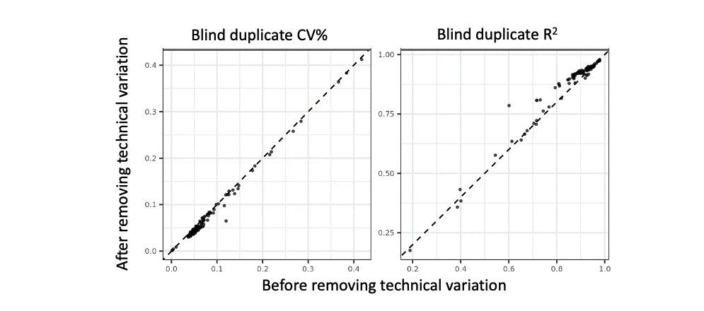
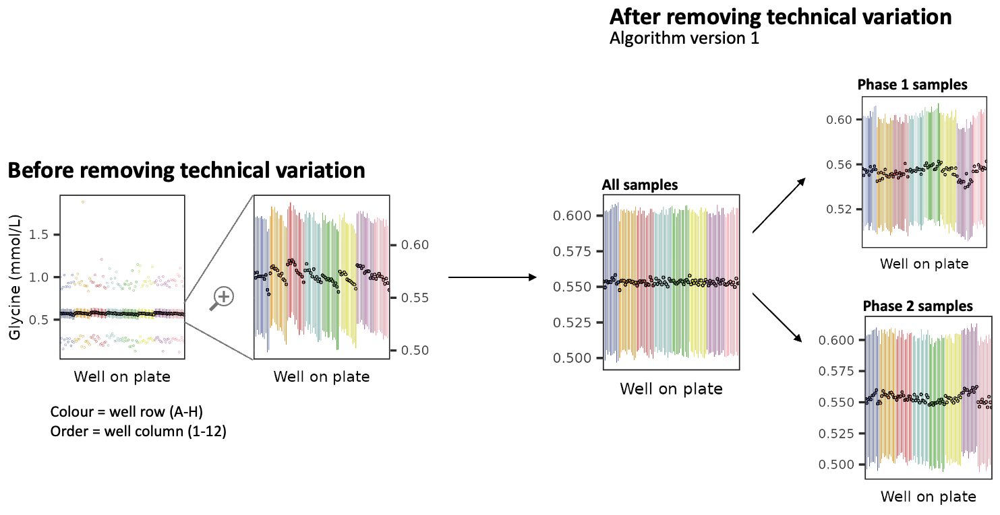
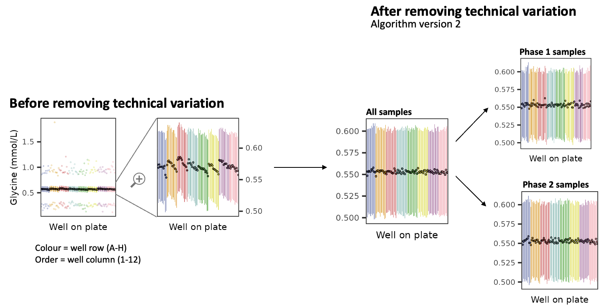
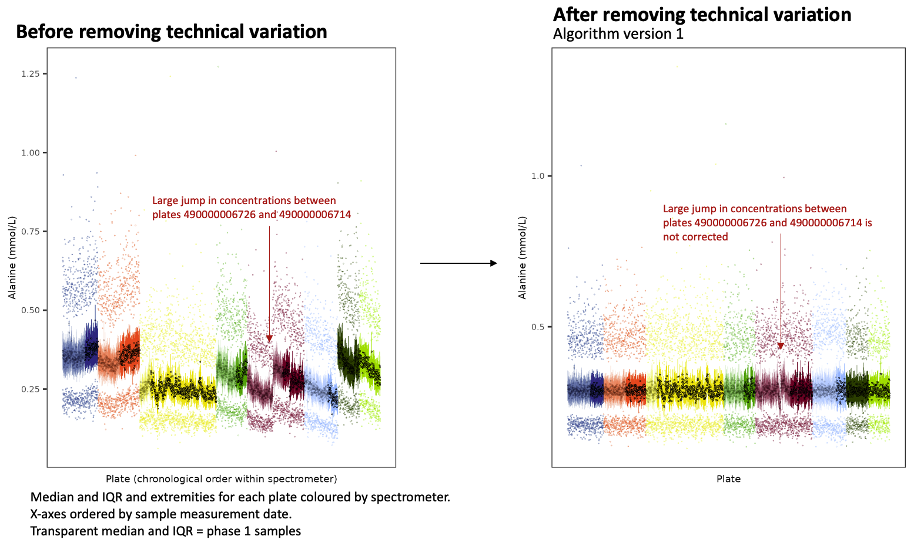
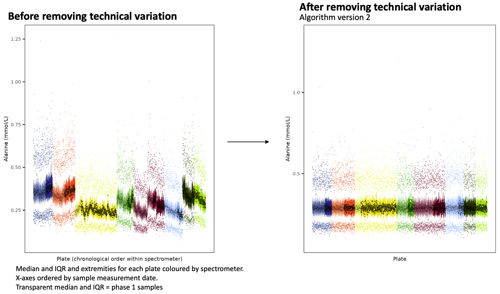

```{r, include = FALSE}
knitr::opts_chunk$set(
  collapse = TRUE,
  comment = "#>"
)
```

This package provides utilities for working with the [UK Biobank NMR metabolomics data](https://biobank.ndph.ox.ac.uk/showcase/label.cgi?id=220).

There are three groups of functions in this package: (1) data extraction, (2) removal of technical variation, and (3) recomputing derived biomarkers and computing additional biomarker ratios.

All functions can be applied directly to UK Biobank data that has been decrypted and converted into a .csv or .txt file using the [ukbconv](https://biobank.ctsu.ox.ac.uk/crystal/exinfo.cgi?src=accessing_data_guide) tool or processed with the [ukbtools](https://cran.r-project.org/package=ukbtools) R package.

This package also provides a `data.frame` of biomarker information, loaded as `nmr_info`, and a `data.frame` of sample processing information, loaded as `sample_qc_info`. See `help("nmr_info")` and `help("sample_qc_info")` for details on column contents. 

Note several updates have been made to the package to reflect the new tranche of NMR data released by UK Biobank in July 2023 covering ~275,000 UK Biobank participants. See the sections below on (1) [updates made to the algorithm for removing technical varation](#algorithms-for-removing-technical-variation), (2) [justification for algorithm modifications based on our exploration of the new tranche of data](#justification-for-algorithm-updates), and (3) [an overview of the impact of technical varation and its removal on the new tranche of data](#technical-variation-in-the-phase-2-release-of-uk-biobank-nmr-data).

## Citation

If using this package to remove additional technical variation or compute additional biomarker ratios, please cite:

Ritchie S. C. *et al.*, Quality control and removal of technical variation of NMR metabolic biomarker data in ~120,000 UK Biobank participants, <ins>Sci Data</ins> *10* 64 (2023). doi: [10.1038/s41597-023-01949-y](https://www.nature.com/articles/s41597-023-01949-y).

Citation is appreciated, but not expected, if simply using the data extraction functions for convenience to extract the NMR biomarker data and associated information as-is into analysis-ready data.frames. 

## Data Extraction Functions

Three data extraction functions are supplied by this package for extracting the UK Biobank NMR data and associated processing information and quality control tags into an analysis-ready format from UK Biobank data that has been decrypted and converted into a .csv or .txt file using the [ukbconv](https://biobank.ctsu.ox.ac.uk/crystal/exinfo.cgi?src=accessing_data_guide) tool or processed with the [ukbtools](https://cran.r-project.org/package=ukbtools) R package.

The `extract_biomarkers()` function returns a `data.frame` with one column for each [NMR metabolomics biomarker fields](https://biobank.ndph.ox.ac.uk/showcase/label.cgi?id=220), which are given short comprehensible and analysis friendly column names as described in the `nmr_info` `data.frame` supplied by this package. Each row of the `data.frame` corresponds to a single observation for a participant at a given timepoint: the `"eid"` column gives the participant ID in your UK Biobank application, and the `"visit_index"` column indicates the UK Biobank assessment corresponding to the observation: either `0` for baseline assessment (2006-2010) or `1` for the first repeat assessment (2012-2013)). 

The `extract_biomarker_qc_flags()` function similarly returns a `data.frame` with one column for each biomarker, with observations containing the [quality control flags](https://biobank.ndph.ox.ac.uk/showcase/label.cgi?id=221) for the measurement of the respective biomarker for the UK Biobank participant and timepoint indicated in the `"eid"` and `"visit_index"` columns. Observations with no quality control flags contain `NA`. In instances where there were multiple quality control flags, the individual flags are separated by `"; "`.

The `extract_sample_qc_flags()` function returns a `data.frame` with one column for each of the [NMR sample processing flags and quality control flags](https://biobank.ndph.ox.ac.uk/showcase/label.cgi?id=222) for each sample for the respective UK Biobank participant (`"eid"`) and timepoint (`"visit_index"`).

An example workflow for extracting these data and saving them for later use:

```{r eval=FALSE}
library(ukbnmr)

decoded <- fread("path/to/decoded_ukbiobank_data.csv") # file saved by ukbconv tool

nmr <- extract_biomarkers(decoded)
biomarker_qc_flags <- extract_biomarker_qc_flags(decoded)
sample_qc_flags <- extract_sample_qc_flags(decoded)

fwrite(nmr, file="path/to/nmr_biomarker_data.csv")
fwrite(biomarker_qc_flags, file="path/to/nmr_biomarker_qc_flags.csv")
fwrite(sample_qc_flags, file="path/to/nmr_sample_qc_flags.csv")
```

You can try this out using the test dataset bundled with the `ukbnmr` package:

```{r}
library(ukbnmr)

decoded <- ukbnmr::test_data # see help("test_data") for more details

nmr <- extract_biomarkers(decoded)
biomarker_qc_flags <- extract_biomarker_qc_flags(decoded)
sample_qc_flags <- extract_sample_qc_flags(decoded)
```

## Removal of technical variation

The `remove_technical_variation()` function removes additional technical variation present in the UK Biobank NMR data (see [section below](#algorithms-for-removing-technical-variation) for details), returning a `list` containing the corrected NMR biomarker data, biomarker QC flags, and sample processing information in analysis-ready `data.frame`s.

This function takes 10-15 minutes to run, and requires at least 16 GB of RAM, so you will want to save the output, rather than incorporate this function into your analysis scripts.
      
An example workflow for using this function and saving the output for loading into future R sessions or other programs:

```{r eval=FALSE}
library(ukbnmr)
decoded <- fread("path/to/decoded_ukbiobank_data.csv") # file save by ukbconv tool

processed <- remove_technical_variation(decoded) 

fwrite(processed$biomarkers, file="path/to/nmr_biomarker_data.csv")
fwrite(processed$biomarker_qc_flags, file="path/to/nmr_biomarker_qc_flags.csv")
fwrite(processed$sample_processing, file="path/to/nmr_sample_qc_flags.csv")
fwrite(processed$log_offset, file="path/to/nmr_biomarker_log_offset.csv")
fwrite(processed$outlier_plate_detection, file="path/to/outlier_plate_info.csv")
```

You can try this out using the test dataset bundled with the `ukbnmr` package:

```{r}
library(ukbnmr)

decoded <- ukbnmr::test_data # see help("test_data") for more details

processed <- remove_technical_variation(decoded)
```

## Methods for computing derived biomarkers and ratios after adjusting for biological variation

Analysts may wish to further adjust data for biological covariates. We provide an additional function, `recompute_derived_biomarkers()` to recompute all composite biomarkers and ratios from 107 non-derived biomarkers, which is useful for ensuring data consistency when adjusting for unwanted biological variation. A companion function, `recompute_derived_biomarker_qc_flags()` will aggregate the QC flags for the biomarkers underlying each composite biomarker and ratio.

Note these functions assume the data has been returned to absolute units after adjusting for covariates. For example the ratio of two biomarkers A and B is computed as A/B, which may not be true if the two biomarkers are on different scales (e.g. regression residuals) after adjustment.

If using these functions, please cite:

Ritchie S. C. *et al.*, Quality control and removal of technical variation of NMR metabolic biomarker data in ~120,000 UK Biobank participants, <ins>Sci Data</ins> *10* 64 (2023). doi: [10.1038/s41597-023-01949-y](https://www.nature.com/articles/s41597-023-01949-y).

An example workflow:

```{r eval=FALSE}
library(ukbnmr)

# First, if we haven't corrected for unwanted technical variation we do so
# using the appropriate function (see help("remove_technical_variation")).
decoded <- fread("path/to/decoded_ukbiobank_data.csv") # file save by ukbconv tool

processed <- remove_technical_variation(decoded)
tech_qc <- processed$biomarkers

fwrite(tech_qc, file="path/to/nmr_biomarker_data.csv")
fwrite(processed$biomarker_qc_flags, file="path/to/nmr_biomarker_qc_flags.csv")
fwrite(processed$sample_processing, file="path/to/nmr_sample_qc_flags.csv")
fwrite(processed$log_offset, file="path/to/nmr_biomarker_log_offset.csv")
fwrite(processed$outlier_plate_detection, file="path/to/outlier_plate_info.csv")

# Otherwise assuming we load 'tech_qc' from "path/to/mr_biomarker_data.csv".

# We now run code to adjust biomarkers for biological covariates. This code is
# not supplied by this package, but for illustrative purposes we assume the user
# has written a function to do this:
bio_qc <- user_function_to_adjust_biomarkers_for_covariates(tech_qc)

# Now we recompute the composite biomarkers and derived ratios after
# adjustment for additional biological covariates
bio_qc <- recompute_derived_biomarkers(bio_qc)
fwrite(bio_qc, file="path/to/nmr_biomarkers_adjusted_for_covariates.csv")

# You may also want to aggregate and save the quality control flags for each
# sample from the biomarkers underlying each derived biomarker or ratio,
# adding them as additional columns to the input data (see
# help("recompute_derived_biomarker_qc_flags")).
biomarker_qc_flags <- recompute_derived_biomarker_qc_flags(nmr)
fwrite(biomarker_qc_flags, file="path/to/biomarker_qc_flags.csv")
```

## Algorithms for removing technical variation

The algorithm used for removing this technical variation is based on our previously described approach published in [Ritchie *et al.* 2023](https://www.nature.com/articles/s41597-023-01949-y). 

Two versions of the algorithm are currently implemented: version 1, which was developed based on the characterisation of the variation present in the phase 1 public release of the UK Biobank NMR data and is as described in the publication, and version 2, which has been developed based on our subsequent characterisation of the technical variation present in the phase 2 public release data (see [section below](#technical-variation-in-the-phase-2-release-of-uk-biobank-nmr-data) for details). 

Version 2 of the algorithm is new as of `ukbnmr` package version 2.0, and is the default when running `remove_technical_variation()`.

### Algorithm version 1

Version 1 of the algorithm applies a multi-step process to remove unwanted technical variation: 

  1. First biomarker data is filtered to the 107 biomarkers that cannot be derived from any combination of other biomarkers.
  2. Absolute concentrations are log transformed, with a small offset applied to biomarkers with concentrations of 0.
  3. Each biomarker is adjusted for the time between sample preparation and sample measurement (hours) on a log scale.
  4. Each biomarker is adjusted for systematic differences between rows (A-H) on the 96-well shipment plates.
  5. Each biomarker is adjusted for remaining systematic differences between columns (1-12) on the 96-well shipment plates.
  6. Each biomarker is adjusted for drift over time within each of the six spectrometers. To do so, samples are grouped into 10
     bins, within each spectrometer, by the date the majority of samples on their respective 96-well plates were measured.
  7. Regression residuals after the sequential adjustments are transformed back to absolute concentrations.
  8. Samples belonging to shipment plates that are outliers of non-biological origin are identified and set to missing.
  9. The 61 composite biomarkers and 81 biomarker ratios are recomputed from their adjusted parts.
  10. An additional 76 biomarker ratios of potential biological significance are computed.


### Algorithm version 2

Version 2 of the algorithm (the default) modifies this algorithm:

  - Steps 4 and 5 above are performed within each processing batch
  - Step 6 above is modified to:

      1. group samples into bins of ~2,000 samples 
      2. hard codes a bin split on spectrometer 5 between plates 490000006726 and 490000006714

These changes have been made based on our exploration of the technical variation in the phase 2 release (July 2023) of the UK Biobank NMR data (see [section below](#justification-for-algorithm-updates) for details).

## Technical variation in the phase 2 release of UK Biobank NMR data

The July 2023 release of the UK Biobank NMR data covers ~275,000 UK Biobank participants, including ~122,000 measured as part of the phase 1 release (June 2021).

The following figures below summarise the impact of the possible sources of variation on this updated dataset, and the impact of applying version 2 of our algorithm for removing technical variation, similar to what was shown in Figure 2 of [Ritchie *et al.* 2023](https://www.nature.com/articles/s41597-023-01949-y) for the phase 1 release data: 

{width=98%}


{width=98%}

Extended diagnostic plots for all biomarkers are available to download on FigShare at [10.6084/m9.figshare.23686407](https://doi.org/10.6084/m9.figshare.23686407).

### Justification for algorithm updates

Our exploration of this updated data release (advance access under UK Biobank application 30418) revealed several changes were needed to our existing algorithm for removing technical variation developed on the phase 1 data.

First, we observed that correcting for systematic differences in well position (steps 4 and 5 of the algorithm) over all 275,000 participants introduced systematic differences between the phase 1 and phase 2 data release samples:

<center>
{width=80%}
</center>

Further exploration revealed that the systematic differences in well position differed between processing batches, and we therefore modified our algorithm to correct for well position within each processing batch separately:

<center>
{width=80%}
</center>

Second, we found that the method for correcting for drift over time (step 6 of the algorithm) needed updating for two reasons:

  1. Partitioning spectrometers into 10 bins meant that the bin sizes would differ between data releases, and that as the sample size increased within each spectrometer, more unwanted variation was being retained.
  2. A large change in concentrations between sequential sets of plates on spectrometer 5 was not being appropriately account for.

These issues were fixed as described above by setting a fixed bin size when correcting for drift over time, and hard-coding as a bin boundary the large change in concentrations observed on spectrometer 5 between plates 490000006726 and 490000006714. The fixed bin size chosen was 2,000 samples, matching the median bin size when applying version 1 of the algorithm to the phase 1 data release. This bin size is approximate, and differs between spectrometers. The number of bins each spectrometer is divided into is set as the total number of samples divided by 2,000. When allocating samples to bins, samples on the same plate or date are always allocated to the same bin.

The following figure illustrates the result of applying version 1 of the algorithm to the alanine concentrations in the July 2023 release of the UK Biobank NMR data covers ~275,000 UK Biobank participants:

<center>
{width=80%}
</center>

And how this changes with version 2 of the algorithm:

<center>
{width=80%}
</center>

